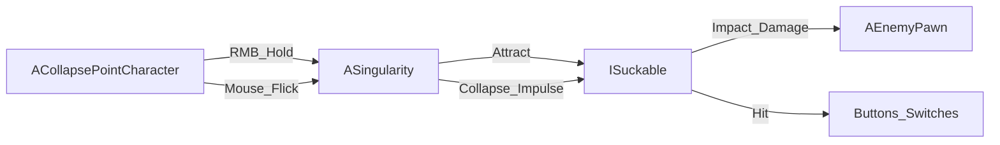

# 技术规格 — C++ 优先

本规格冻结 Demo 实现路径：**玩法逻辑全部在 C++**；蓝图仅作关卡摆放与表现资产薄封装。不在此阶段创建工程或资产。

## 架构总览



## 类与职责

| 类 | 职责 |
|----|------|
| `ACollapsePointCharacter` | 第三人称移动与跳跃；Enhanced Input；瞄准 Trace；奇点拖动跟随；甩动加力采样；左键自身弹跳；轻吸引与贴脸风险结算 |
| `ASingularity` | 生命周期、拖动、累计质量、能量计时、超时崩塌、按准星方向分发冲量；持有吸引组件与表现钩子 |
| `USingularityAttractComponent` | 每 Tick 对范围内 `ISuckable` 施加吸引力；强度随质量曲线缩放；维护被吸引物体列表 |
| `ISuckable` | 接口：是否可吸、贡献质量、被吸引回调、获取用于冲量的 Primitive |
| `APhysicsObject` | 默认可吸入静态网格 Actor；记录质量倍率、撞击伤害系数；实现 `ISuckable` |
| `AEnemyPawn` | 简单位移 AI（走向玩家）；接触伤害；物理可吸；实现 `ISuckable`；受撞击伤害阈值 |
| `ATriggerButton` | 被足够冲量/质量的物体击中后开门（A 区） |
| `ADualSwitchShield` | 左右开关在短时间窗口内均被命中则关闭护盾（C 区） |
| `UCollapsePointCameraFX` | 开关色散/径向模糊等后处理参数（材质与 MID 由资产引用，逻辑在 C++） |

模块建议：单一游戏模块 `CollapsePoint`（或工程同名模块），上述类均放入该模块。

## 输入（Enhanced Input，C++ 绑定）

| Action | 触发 | 行为 |
|--------|------|------|
| `IA_Singularity` | 按住 / 松开 | 按下：瞄准点 Spawn `ASingularity`；按住：拖动奇点 + 吸引；松开：`Collapse(AimDir, FlickBoost)` |
| `IA_Nudge` | 按下 | **自身短距弹跳 / 反冲**（位移）；不对瞄准射击负责 |
| Look / Move / Jump | 标准第三人称 | 模板保留；删除射击相关 Mapping 与代码 |

### 瞄准与拖动

- 从相机中心做 Line Trace，命中点（或最大距离处）为奇点**初始**生成位置。
- 按住期间奇点以有限速度（`DragFollowSpeed`）平滑跟随准星命中点——**可拖动捞物**。
- 同一时间只允许 **一个** 存活奇点；崩塌后 `SingularityCooldown`（默认 0.3s）内不可再开。

### 崩塌方向（准星为主，甩动为加力）

在奇点存活期间采样短窗口甩动，得到标量/向量 `FlickBoost`（加力，不覆盖主方向）。

```
AimDir     = CameraForward（松手瞬间）
Impulse    = AimDir * (BaseSpeed(Mass) + FlickBoostMagnitude)
           + RandomCone(ScatterAngle)   // 仅噪声，±8–15°
```

可选：保留小比重的切线分量，使「裹着转再甩出」观感更强，但 **AimDir 权重必须明显占优**。

伪代码接口形状：

```cpp
// ACollapsePointCharacter
void OnSingularityStarted();
void OnSingularityReleased();
FVector GetAimDirection() const;
float ConsumeFlickBoost() const;  // 加力标量

// ASingularity
void BeginAttract();
void TickDragToward(FVector WorldTarget, float DeltaTime);
void AddConsumedMass(float Mass);
void Collapse(FVector AimDir, float FlickBoost);
void ForceCollapseByTimeout();
```

```cpp
// ISuckable
bool CanBeSucked() const;
float GetSuckMass() const;
UPrimitiveComponent* GetSuckPrimitive() const;
void OnSuckedTick(const FVector& Force);
```

## 吸引与质量

- **不用** 纯 `RadialForceComponent` 作为唯一方案：吸引力由 `USingularityAttractComponent` 在 C++ 中按曲线施加（可用 `AddForce` / `AddImpulse`），便于质量缩放与调试。
- 进入吸引半径且 `CanBeSucked()` 的物体加入 `AttractedActors`；首次吸入时 `AddConsumedMass`。
- 吸引强度：`Force = AttractCurve.Eval(Elapsed) * MassScale(CurrentMass)`，方向指向奇点中心，可附带切向扰动形成「悬空旋转」观感。

## 崩塌

触发条件：玩家松开 RMB，或 `Elapsed >= MaxLifetime`（默认 2.5s）。

对 `AttractedActors` 中每个有效 `ISuckable`：

1. 以松手瞬间 **AimDir（准星）** 为主抛射轴。  
2. 叠加 `FlickBoost`（甩动加力）与小幅 `RandomCone`。  
3. `AddImpulse`；清空列表；进入冷却；销毁或停用奇点；通知 CameraFX 关闭扭曲。  
4. 若玩家在近距内，对其施加较弱反冲，并按规则结算贴脸风险伤害。

## 玩家与奇点

| 规则 | 说明 |
|------|------|
| 轻吸引 | 玩家受较弱引力（位移干扰），`CanBeSucked` 对玩家为 false（不被吞入销毁） |
| 贴脸风险 | 崩塌时若玩家在 `SelfDangerRadius` 内，受到伤害或强击退 |
| 友军伤害 | 自抛碎片可伤害玩家（阈值可略高于打敌人，避免过虐） |
| 左键 | 仅 `LaunchCharacter` / 自身冲量，用于位移与黑洞冲浪衔接 |

## 伤害与交互

| 规则 | 说明 |
|------|------|
| 撞击伤害 | 物体 `Speed * Mass * DamageScale` 超过目标阈值则造成伤害 |
| 轻型敌人 | 较低阈值；高速抛射或互撞可击杀 |
| 重型敌人 | 高阈值；小碎片无效；爆炸桶 / 重球有效；可选「仅侧面/背后高压有效」一种可读差异 |
| 爆炸桶 | 实现为 `APhysicsObject` 子类或组件：受足够撞击后 overlap 范围内 ApplyDamage |
| 按钮 / 开关 | 检测来自物理物的 Hit；校验最小冲量；开关置位 |
| 双开关窗口 | `ADualSwitchShield` 使用短同步窗口（如 0.4–0.8s），非同一帧；失败多次可关卡侧放宽 |

## 表现（逻辑 C++，资产后挂）

- Niagara：奇点漩涡（`ASingularity` 上组件引用，可空指针安全）。
- 后处理：`UCollapsePointCameraFX` 在 Begin/Collapse 时插值色散、径向模糊强度。
- 可用 `BlueprintImplementableEvent` **仅** 作为可选表现钩子（如 `OnSingularityOpened` 播放音效）；**不得** 在蓝图中实现吸引/崩塌/伤害状态机。

## 调参表（推荐初值）

打磨预计占开发时间 **60%**。下列为起始值，全部暴露为 `UPROPERTY(EditAnywhere, Category="CollapsePoint")` 供在细节面板调（C++ 默认，不依赖蓝图图表）。

| 参数 | 推荐初值 | 说明 |
|------|----------|------|
| `MaxLifetime` | 2.5 s | 超时自动崩塌 |
| `SingularityCooldown` | 0.3 s | 崩塌后再次开启硬冷却 |
| `DragFollowSpeed` | 中等 | 按住时奇点追随准星的最大速度 |
| `BaseAttractRadius` | 400 uu | 零质量时吸引半径 |
| `RadiusPerMass` | 15 uu | 每单位质量增加半径 |
| `AttractForceBase` | 5e5 | 基础吸引力量级（按项目质量单位再标定） |
| `PlayerAttractScale` | 0.15–0.25 | 玩家轻吸引相对强度 |
| `SelfDangerRadius` | 略小于吸引半径 | 贴脸崩塌风险区 |
| `MassGainPerObject` | 物体 PhysMass × 系数 | 吸入贡献 |
| `CollapseSpeedBase` | 800–1200 | 崩塌基础抛射速率 |
| `CollapseSpeedPerMass` | 线性或缓入曲线 | 质量越大甩得越狠 |
| `ScatterAngleDeg` | 8–15° | 随机锥角（噪声，非主方向） |
| `FlickWindow` | 0.12 s | 甩动加力采样窗口 |
| `FlickBoost` | 600–1000 | 甩动附加速率 |
| `NudgeImpulse` | 中小 | 左键自身弹跳 |
| `DualSwitchWindow` | 0.4–0.8 s | 左右开关同步窗口 |
| `LightEnemyImpactThreshold` | 低 | B 区敌人 |
| `HeavyEnemyImpactThreshold` | 高 | C 区重型 |
| `CameraChromaticMax` | 轻微 | 第 5 秒钩子，避免晕眩 |
| `CameraRadialBlurMax` | 轻微 | 同上 |

## 蓝图边界（强制）

**允许**

- 关卡中拖放 C++ Actor（或极薄 `BP_` 子类仅改默认数值 / 挂网格与 Niagara 资产）。
- 材质、Niagara 系统、声音、关卡 BSP/静态网格摆放。
- 可选：`BlueprintImplementableEvent` 表现回调。

**禁止**

- 在蓝图中实现奇点 Tick 吸引、质量累计、崩塌冲量、敌人 AI、伤害判定、开关逻辑。
- 用蓝图复制一套与 C++ 并行的玩法状态机。

原则一句话：**配置可以是数据，玩法必须是代码。**

## 工程假设（实现阶段）

- Unreal Engine 5.x，第三人称 C++ 模板起步。
- 物理：Chaos；可吸入物开启 Simulate Physics。
- 无存档、无主菜单；`GameMode` 直接加载试验腔 Map。
